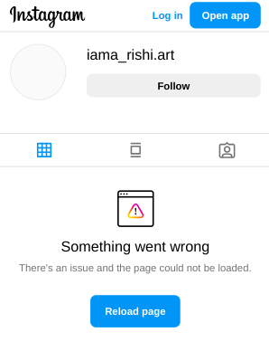

In my [cool](../updates) section, I have built and integrated the following features:

- Display my most recent commit to a GitHub repository.
- Show the most recent song I played on Spotify.
- Show the book I am currently reading, with data fetched from Goodreads.

I left a dummy section because I wanted an even number of features, and three didn't seem sufficient. So, I decided to add another feature to display my artwork from my Instagram art page.

However, Instagram recently made changes that complicate things. Now, accessing anything from their `/api` endpoint returns a `useragent mismatch` error."

`$ curl https://www.instagram.com/api/v1/users/web_profile_info/\?username\=iama_rishi.art`

- `{"message":"useragent mismatch","status":"fail"}`

Alright, the solution is straightforward. Just download a user agent switcher for your browser and override the current user agent with the following:

`Mozilla/5.0 (iPhone; CPU iPhone OS 11_2_6 like Mac OS X) AppleWebKit/604.5.6 (KHTML, like Gecko) Mobile/15D100 Instagram 37.0.0.9.96 (iPhone7,2; iOS 11_2_6; pt_PT; pt-PT; scale=2.34; gamut=normal; 750x1331)`

There are many more available [here](https://user-agents.net/applications/instagram-app/versions/37-0), so pick the one that works for you. Now, when we make a request to the same URL with the above user agent, we get some useful data. Well, maybe not that exciting, but it's exactly what I needed.

```sh
$ curl -H "User-Agent: Mozilla/5.0 (iPhone; CPU iPhone OS 11_2_6 like Mac OS X) AppleWebKit/604.5.6 (KHTML, like Gecko) Mobile/15D100 Instagram 37.0.0.9.96 (iPhone7,2; iOS 11_2_6; pt_PT; pt-PT; scale=2.34; gamut=normal; 750x1331)" https://www.instagram.com/api/v1/users/web_profile_info/\?username\=iama_rishi.art | jq
```

*response*

```json
{
  "data": {
    "user": {
      "ai_agent_type": null,
      "biography": "This is not who I am.",
      "bio_links": [
        {
          "title": "",
          "lynx_url": "https://l.instagram.com/?u=https%3A%2F%2Fir8x.github.io%2F&e=AT3eu97qxDVVnBgrLTHoILtmPfYcae04PoD23Y-AljBLRSsV-OBZkbclggsIEirR9dmBseMPMsXtPi9wAp1eBFvmTiRzDhRrgFuOJ4C6rnt0zp87",
          "url": "https://ir8x.github.io/",
          "link_type": "external"
        }
      ],
      "fb_profile_biolink": null,
      "biography_with_entities": {
        "raw_text": "This is not who I am.",
        "entities": []
      },
      "blocked_by_viewer": false,
      "restricted_by_viewer": null,
      "country_block": false,
      "eimu_id": "17842547147306444",
      "external_url": "https://ir8x.github.io/",
      "external_url_linkshimmed": "https://l.instagram.com/?u=https%3A%2F%2Fir8x.github.io%2F&e=AT1ercjLdYOR_tCoeBmXvImOwDT4UWUh2I8ERrG04vS5u1lypJHRcoX-j8g5W4D7mQGuw84HYc9mPatL0rXcYRI-g5mGwqrLEeCNgaGCPU8bwOcB",
      "edge_followed_by": {
        "count": 74
      },
      "fbid": "17841439193296155",
      "followed_by_viewer": false,
      "edge_follow": {
        "count": 27
      }
    }
  }
}
```

We're doing some content negotiation here. Imagine you have plenty of cocaine being sent to you. Despite this, you want more so for some odd reasons. To get more, you need to visit the dealer. You know where he lives, and he has given you keys to his house, but the cocaine is hidden in a secret room. The dealer is generous and offers a passcode to access this secret room. You, with your high moral ground, don't want to consume the cocaine, but you do want to show a glimpse of it. So, you get the passcode and take a step forward for your own purposes, whatever they might be. Anyway, this was stupid.


As I was getting data perfectly through `curl`, I decided to port the command to a simple flask application. Here's the complete code -


```python
from flask import Flask, jsonify
import requests

app = Flask(__name__)

INSTAGRAM_USERNAME = 'iama_rishi.art'

@app.route('/instagram', methods=['GET'])
def instagram_profile():
    url = f'https://www.instagram.com/api/v1/users/web_profile_info/?username={INSTAGRAM_USERNAME}'
    headers = {
        'User-Agent': 'Mozilla/5.0 (iPhone; CPU iPhone OS 11_2_6 like Mac OS X) AppleWebKit/604.5.6 (KHTML, like Gecko) Mobile/15D100 Instagram 37.0.0.9.96 (iPhone7,2; iOS 11_2_6; pt_PT; pt-PT; scale=2.34; gamut=normal; 750x1331)',
        'Accept': 'text/html,application/xhtml+xml,application/xml;q=0.9,image/avif,image/webp,*/*;q=0.8',
        'Accept-Encoding': 'gzip, deflate, br, zstd',    }

    try:
        response = requests.get(url, headers=headers)
        response.raise_for_status()
        return jsonify(response.json())
    except requests.exceptions.RequestException as e:
        return jsonify({'error': str(e)}), 500

if __name__ == '__main__':
    app.run(debug=True)
```

This threw error, which was


`json.decoder.JSONDecodeError: Expecting value: line 1 column 1 (char 0)`


The response from the Instagram API was not valid JSON. This was confusing because when using curl, I was getting the data correctly. However, something was not right. The API was returning data in a different format, and I couldn't determine which format it was.

I opened the network tab to see what was happening. I checked the response for `/api/v1/users/web_profile_info/?username=iama_rishi.art` and saw the following:

`SyntaxError: JSON.parse: unexpected character at line 1 column 1 of the JSON data`

The response type was - `vnd.mozilla.json.view`. Strange MIME type, but from the name it was clear that it's being used to denote JSON data that is intended for viewing within a Mozilla environment, possibly with some specific formatting. It's not mentioned in [mdn web docs](https://developer.mozilla.org/en-US/docs/Web/HTTP/Basics_of_HTTP/MIME_types/Common_types) so it's mainly some META thingy. God knows, and I don't care.

Here's a snippet of the response payload:

```
KLUv/WD98/VIAbqp8oM5QCdIuwHCZZgTLiCsRToGAEwxs3d8HV/99de/96qKBMwh8FJgYBC8zi
```

For me, the confusing part was this: if I can retrieve the data using curl and I'm able to access it in the browser with the appropriate user agent, what's happening differently in my Flask application?

It turns out browsers are smart, and curl allows you to request HTTP and HTTPS servers to provide compressed versions of the data and then automatically decompress it upon arrival[^1].

Now, the important question is: What kind of compression method was being used?

**Moving ahead**

I printed out the raw response content:

```python
print(f"Response content: {response.content}")
```

and this gave a sequence of byte -

`b'(\xb5/\xfd\x00X\xe4...xa0UU\x96`

Something I should have done earlier, but I completely forgot and ignored, is to check the content encoding of the response in the network tab.

```
content-encoding: zstd
```

How did that happen? Well, I'm not smart. I take some time to figure things out.

The Instagram API was returning a valid JSON response, but it was compressed using the zstd compression algorithm.

I was still curious about curl being curl so I stumbled upon this [blog post](https://daniel.haxx.se/blog/2020/08/19/curl-7-72-0-more-compression/) by Daniel -

> This is the first curl release that supports zstd compression. zstd is a yet another way to compressed content data over HTTP and if curl supports it, it can then automatically decompress it on the fly. zstd is designed to compress better and faster than gzip and if I understand the numbers shown, it is less CPU intensive than brotli. In pure practical terms, curl will ask for this compression in addition to the other supported algorithms if you tell curl you want compressed content. zstd is still not widely supported by browsers.[^2]


Oh, so that's why I was able to see the response. Anyway, I tweaked the code a little, and everything worked perfectly.

```python
import zstd

response = requests.get(url, headers=headers)
if response.status_code == 200:
    decompressed_content = zstd.decompress(response.content)
    json_data = json.loads(decompressed_content)
```


Here's the complete working solution. Feel free to do whatever.


```python
from flask import Flask, jsonify
import requests
import zstd

app = Flask(__name__)

INSTAGRAM_USERNAME = 'iama_rishi.art'

@app.route('/instagram', methods=['GET'])
def instagram_profile():
    url = f'https://www.instagram.com/api/v1/users/web_profile_info/?username={INSTAGRAM_USERNAME}'
    headers = {
        'User-Agent': 'Mozilla/5.0 (iPhone; CPU iPhone OS 11_2_6 like Mac OS X) AppleWebKit/604.5.6 (KHTML, like Gecko) Mobile/15D100 Instagram 37.0.0.9.96 (iPhone7,2; iOS 11_2_6; pt_PT; pt-PT; scale=2.34; gamut=normal; 750x1331)',
        'Accept': '*/*',
        'Accept-Language': 'en-US,en;q=0.5',
        'Accept-Encoding': 'gzip, deflate, br, zstd',
        'Referer': f'https://www.instagram.com/{INSTAGRAM_USERNAME}/',
    }

    try:
        response = requests.get(url, headers=headers)
        print(f"Response status code: {response.status_code}")
        print(f"Response headers: {response.headers}")

        if response.status_code == 200:
            decompressed_content = zstd.decompress(response.content)
            json_data = json.loads(decompressed_content)
            return jsonify(json_data)
        else:
            return jsonify({'error': f'Request failed with status code {response.status_code}'}), response.status_code
    except requests.exceptions.RequestException as e:
        return jsonify({'error': str(e)}), 500
    except zstd.Error as e:
        return jsonify({'error': 'Failed to decompress response'}), 500
    except json.decoder.JSONDecodeError:
        return jsonify({'error': 'Response is not valid JSON'}), 500

if __name__ == '__main__':
    app.run(debug=True)
```

By using the `zstd` module and directly decompressing the response content with `zstd.decompress(response.content)`, I was able to parse the decompressed data as JSON without any issues.

__*but...*__

In my attempt to figure out the solution, I got restricted. I might have made too many requests and as of now I'm being blocked from accessing any resources. Funny :snail:


{: .center}

To avoid issues, the best approach is to either limit the number of requests or to rotate the IP and user agent simultaneously after a certain period of time. Since I won't be frequently visiting my [cool](../updates) page and it might not receive many views, I will add the current working script as a fourth service and display my last three or one Instagram post, depending on my moood.

__What's next?__

I plan to test all the user agents listed in [this collection](https://user-agents.net/download?browser_type=application&browser=instagram-app&version=37-0) and utilize free proxies from [SSL Proxy List](https://www.sslproxies.org/#list) to monitor how things progress.


__*Updates*__

I still need to test all the user agents, but I was in a rush to integrate the feature that shows my last four posts from my Instagram art account.

The task was fairly straightforward, as my API was returning data successfully.

```sh
$ curl https://ir8x.vercel.app/instagram | jq
```

So, I wrote a simple script -

```js
const response = await fetch('https://ir8x.vercel.app/instagram');
const data = await response.json();

const edges = data.data.user.edge_owner_to_timeline_media.edges;

for (let i = 0; i < 4; i++) {
    const artworks = document.getElementById(`image-${i + 1}`);
    if (artworks && edges[i]) {
        artworks.src = edges[i].node.thumbnail_resources[0].src;
    }
}
```

which inserts the image link into the following HTML -

```html
<div class="instagram-container">
    
    
    
    
</div>
```

__Problem__

`Cross-Origin Request Blocked: The Same Origin Policy disallows reading the remote resource at https://scontent-iad3-1.cdninstagram.com/v/t51.29350-15/440114385_762901505597462_6424360476771940236_n.webp (Reason: CORS header ‘Access-Control-Allow-Origin’ missing). Status code: 200.`

Adding the line `CORS(app)` to my Flask API wouldn't have solved the problem, so I had to think of a different solution. Since I didn't want to make extensive changes, I decided to encode the images to base64 and return that, which provided an easy fix. One important consideration is that I'm not adding links to any of the updates I'm showing, so I can return only what's needed. All I needed was the last four posts from my Instagram art account, so I made some changes to the original script.

```python
base64_images = []
for edge in json_data['data']['user']['edge_owner_to_timeline_media']['edges'][:4]:
    image_url = edge['node']['thumbnail_resources'][0]['src']
    image_response = requests.get(image_url)
    if image_response.status_code == 200:
        base64_data = base64.b64encode(image_response.content).decode('utf-8')
        base64_images.append(base64_data)
    else:
        base64_images.append(None)

return jsonify({'images': base64_images})
```


This would return response as -

```json
{
"images": ["/9j/4AAQSkZJRgABAQAAAQABAAD/...",
           "/9j/4AAQSkZJRgABAQAAAQABAAD/...",
           "/9j/4AAQSkZJRgABAQAAAQABAAD/...",
           "/9j/4AAQSkZJRgABAQAAAQABAAD/..."]
}
```

Then I made a slight change in the JS snippet -

```js
const data = await response.json();
const images = data.images;

const artworks = document.querySelectorAll('.instagram-container img');
for (let i = 0; i < Math.min(artworks.length, images.length); i++) {
    artworks[i].src = 'data:image/jpeg;base64,' + images[i];
}
```

and it worked -


{: .center}

Before this, I wasted some time because of `Mixed Content`.


> What is Mixed Content? <br><br>
When a user visits a page served over HTTP, their connection is open for eavesdropping and man-in-the-middle (MITM) attacks. When a user visits a page served over HTTPS, their connection with the web server is authenticated and encrypted with SSL and hence safeguarded from eavesdroppers and MITM attacks. <br><br> However, if an HTTPS page includes HTTP content, the HTTP portion can be read or modified by attackers, even though the main page is served over HTTPS. When an HTTPS page has HTTP content, we call that content “mixed”. The webpage that the user is visiting is only partially encrypted, since some of the content is retrieved unencrypted over HTTP. The Mixed Content Blocker blocks certain HTTP requests on HTTPS pages.[^3]

I made a typo. Instead of `fetch('https://ir8x.vercel.app/instagram')`, I was using `fetch('http://ir8x.vercel.app/instagram')`. Changing the protocol solved my issue.

I have now integrated it into my [cool](../updates) page, and it looks good. Building this was a bit of a roller coaster ride, but I had fun.

---

__Footnotes:__

[^1]: [Compression - Everything CURL](https://everything.curl.dev/usingcurl/downloads/compression.html)
[^2]: [CURL 7.72.0 - More Compression](https://daniel.haxx.se/blog/2020/08/19/curl-7-72-0-more-compression/)
[^3]: [Mixed Content Blocking Enabled in Firefox 23](https://blog.mozilla.org/tanvi/2013/04/10/mixed-content-blocking-enabled-in-firefox-23/)
