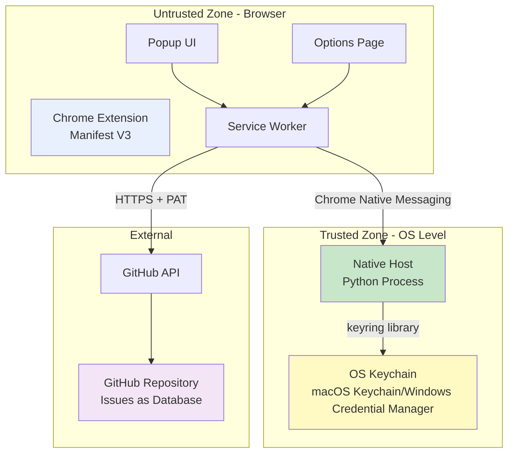
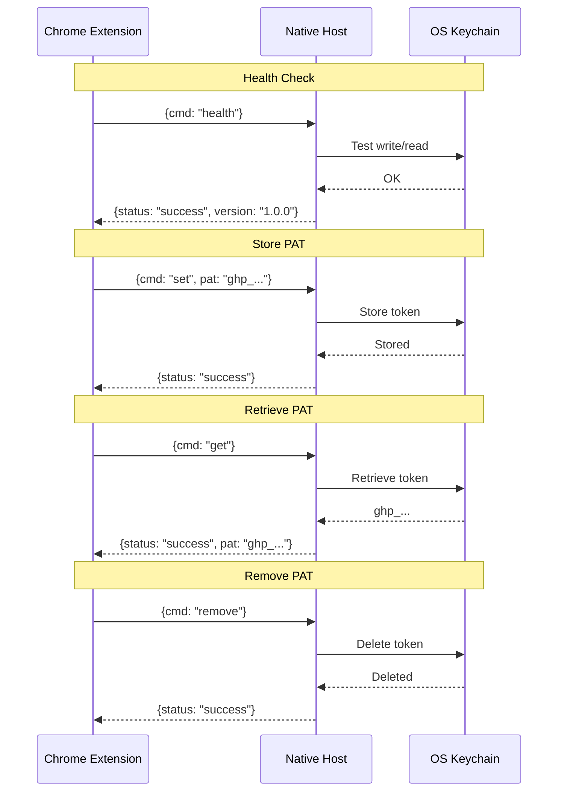
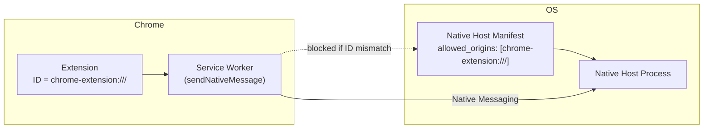
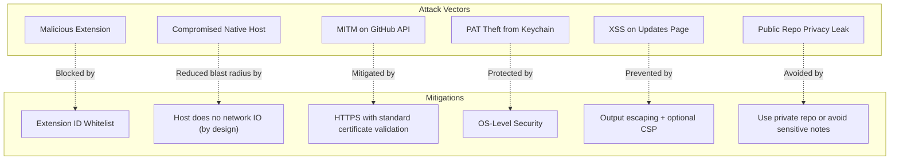
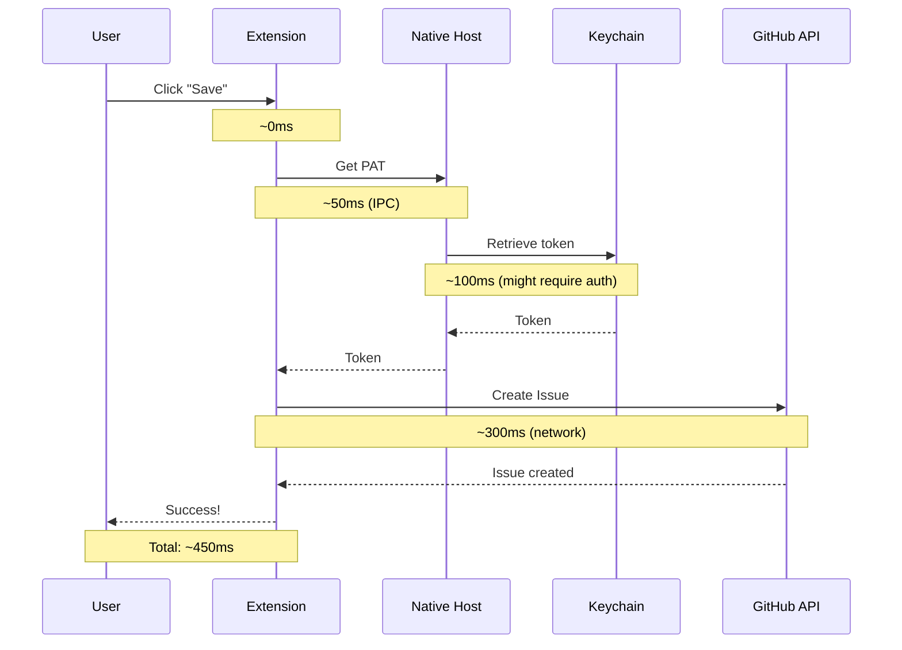




<span class="highlight-black"><a href="https://github.com/CodeDotJS/mookbarked">Mookbarked @ Github</a></span>
{: .center }

---

I used Pocket for years to save articles and videos. When it shut down, I needed a simple replacement. I have a [`/updates`](/updates) page on my blog that shows the last 3 articles and videos I liked—it used to pull from Pocket's API. Now I needed:

- a quick way to bookmark links (articles + videos)
- an API I could use to fetch the latest 3 of each for my existing [`/updates`](/updates) page
- no backend to deploy or maintain

I wanted something different:
- **Local-first-ish**: no custom server, and data stored somewhere I already use (GitHub)
- **Simple**: minimal moving parts
- **Secure enough for my use**: avoid putting a GitHub token in browser storage

So I built it. When it came to storing the GitHub Personal Access Token (PAT), I wanted to do it safely and also learn about native messaging and OS keychains. I used this project to explore a bit more of Chrome extensions, native messaging protocols, and OS credential stores.

---

## Architecture: Trust Boundaries
{: .center}

A Chrome extension runs in a sandbox—it has limited access to your system, which is good for security but bad for storing secrets. The browser's storage APIs (localStorage, IndexedDB, chrome.storage) are all accessible to the extension's JavaScript, which means they're not secure enough for sensitive credentials.

The solution:



The browser **never** sees my Personal Access Token except when it's being used. The token lives in my OS keychain, retrieved on-demand by a native process that only my extension can talk to.

One important note: storing the PAT in the OS keychain via a native host is not the *only* way to make this work. I chose it primarily because I wanted to learn a new security boundary and avoid leaving long-lived secrets in browser storage.

---

## Component 1: The Native Messaging Host

### What is Native Messaging?

Chrome's Native Messaging API lets extensions communicate with native applications on your computer. It's a way to break out of the browser sandbox—but only with explicit user permission and strict security controls.

The protocol is simple:
1. Messages are JSON objects
2. Each message is prefixed with a 4-byte length (little-endian uint32)
3. Communication happens over stdin/stdout
4. The native host must be listed in a manifest that restricts which extensions can use it

Here's the message format:

```python
import struct
import json
import sys

def send_message(message: dict):
    """Send a message to Chrome using Native Messaging protocol"""
    encoded = json.dumps(message).encode('utf-8')
    length = struct.pack('I', len(encoded))  # 4 bytes, little-endian

    sys.stdout.buffer.write(length)
    sys.stdout.buffer.write(encoded)
    sys.stdout.buffer.flush()

def read_message():
    """Read a message from Chrome"""
    # Read 4-byte length prefix
    length_bytes = sys.stdin.buffer.read(4)
    length = struct.unpack('I', length_bytes)[0]

    # Read message
    message_bytes = sys.stdin.buffer.read(length)
    return json.loads(message_bytes.decode('utf-8'))
```

### The Credential Storage Problem

Python's `keyring` library interacts with the OS keychain. On macOS, this talks to Keychain Access. On Windows, it uses the Credential Manager. On Linux, it integrates with Secret Service.

The OS handles the security. When I store a token, macOS might require Touch ID or my password. Same when I retrieve it.

One nuance: on Linux in particular, the actual security properties depend on which keyring backend is active (e.g., Secret Service vs. fallback backends). It's worth checking which backend you're using and testing that it behaves as expected on your setup.

```python
import keyring

SERVICE_NAME = "chrome_bookmarks_extension"
USERNAME = "github_pat"

# Store credential
keyring.set_password(SERVICE_NAME, USERNAME, token)

# Retrieve credential
token = keyring.get_password(SERVICE_NAME, USERNAME)

# Delete credential
keyring.delete_password(SERVICE_NAME, USERNAME)
```

### Commands I Implemented

My native host supports four commands:



The host never logs the PAT. Error messages avoid leaking secrets.

---

## Component 2: The Chrome Extension

### Manifest V3: The New Security Model

Chrome's Manifest V3 introduced significant security improvements. The biggest change: background pages are now service workers, which means no persistent state. This works well for this use case—the extension doesn't hold onto credentials.

The manifest:

```json
{
  "manifest_version": 3,
  "name": "MookBarked",
  "version": "1.0.0",

  "permissions": [
    "nativeMessaging",  // Talk to native host
    "activeTab",        // Read current page
    "storage"           // Store GitHub repo config (NOT the PAT!)
  ],

  "host_permissions": [
    "https://api.github.com/*"  // Call GitHub API
  ],

  "background": {
    "service_worker": "background.js"
  },

  "action": {
    "default_popup": "popup.html"
  }
}
```

### The Service Worker Pattern

Service workers can become inactive to save resources. Every message handler must be defined at the top level and handle async operations:

```javascript
chrome.runtime.onMessage.addListener((request, sender, sendResponse) => {
  if (request.action === 'createBookmark') {
    // Handle async operation
    createBookmark(request.data)
      .then(result => sendResponse({success: true, result}))
      .catch(error => sendResponse({success: false, error: error.message}));

    return true; // Keep channel open for async response
  }
});

async function createBookmark(data) {
  // 1. Get PAT from native host
  const pat = await getPAT();

  // 2. Call GitHub API
  const response = await fetch('https://api.github.com/repos/...', {
    method: 'POST',
    headers: {
      'Authorization': `token ${pat}`,
      'Content-Type': 'application/json'
    },
    body: JSON.stringify({...})
  });

  // 3. PAT is automatically garbage collected
  return response.json();
}
```

The PAT exists only during the API call. It's not stored or cached.

### Talking to the Native Host

The `chrome.runtime.sendNativeMessage` API is how the extension talks to the native host:

```javascript
function getPAT() {
  return new Promise((resolve, reject) => {
    chrome.runtime.sendNativeMessage(
      'com.bookmarks.native_host',  // Native host name
      { cmd: 'get' },                // Command
      (response) => {
        if (chrome.runtime.lastError) {
          reject(new Error(chrome.runtime.lastError.message));
        } else if (response.status === 'error') {
          reject(new Error(response.error));
        } else {
          resolve(response.pat);
        }
      }
    );
  });
}
```

Chrome handles the IPC. Send JSON, get JSON back.

---

## Component 3: GitHub Issues as a Database

Instead of building a backend, GitHub Issues serves as the database. Each bookmark is an issue with YAML frontmatter:

```yaml
---
title: "The Art of PostgreSQL"
url: "https://example.com/postgres-article"
provider: "Article"
date_saved: "2025-12-16T10:30:00Z"
---
Great deep dive into PostgreSQL internals. Need to revisit the section on MVCC.
```

Labels categorize bookmarks: `article`, `video`, etc.

### Why This Works

1. **Free hosting**: GitHub hosts it for free
2. **Reliable**: GitHub's uptime is better than anything I'd build
3. **Searchable**: GitHub's issue search is surprisingly good
4. **Version controlled**: Every edit is tracked
5. **Public/Private**: I can make it public to share my reading list
6. **API access**: GitHub's REST API is excellent

### The GitHub API Call

```javascript
const response = await fetch(
  `https://api.github.com/repos/${owner}/${repo}/issues`,
  {
    method: 'POST',
    headers: {
      'Authorization': `token ${pat}`,
      'Content-Type': 'application/json',
      'Accept': 'application/vnd.github.v3+json'
    },
    body: JSON.stringify({
      title: bookmark.title,
      body: yamlFrontmatter,
      labels: ['article']  // or 'video'
    })
  }
);
```

The PAT needs the `repo` scope (or `public_repo` for public repositories only).

If you can, prefer least privilege: a token that is scoped to a single repository (fine-grained tokens) is safer than a token that can write to many repos.

---

## Component 4: The Updates Page

A simple static HTML page fetches and displays the latest bookmarks. It's completely client-side—no server needed. This replaces the Pocket API integration on my blog's `/updates` page.

*I've yet to push the changes though. It's not live yet. Thought yet, yet though.*
{: .center}

### Fetching Public Issues

GitHub's REST API allows unauthenticated reads of public repositories:

```javascript
const response = await fetch(
  `https://api.github.com/repos/${owner}/${repo}/issues?labels=article&state=open&per_page=3`
);

const issues = await response.json();
```

Rate limit: 60 requests per hour for unauthenticated requests. For personal use, this is plenty.

### Parsing YAML Frontmatter

Extracting metadata from the issue body uses a simple regex:

```javascript
function parseYAMLFrontmatter(body) {
  const match = body.match(/^---\n([\s\S]*?)\n---\n?([\s\S]*)$/);
  if (!match) return null;

  const yaml = match[1];
  const content = match[2];

  // Parse YAML (simple key: value pairs)
  const metadata = {};
  yaml.split('\n').forEach(line => {
    const [key, ...value] = line.split(':');
    if (key && value.length) {
      metadata[key.trim()] = value.join(':').trim().replace(/^["']|["']$/g, '');
    }
  });

  return { metadata, content };
}
```

For production use, I'd use a proper YAML library like `js-yaml`, but for my simple schema, this works fine.

---

## Installation on macOS

Installing on macOS turned out to be a major hectic.

**Context:** First time doing development on macOS. Coming from Linux, every macOS-specific quirk was new.

### Issue 1: The pyenv Shim Problem

pyenv manages Python versions via "shims"—lightweight scripts that redirect to the actual Python binary. The gotcha: Chrome launches native messaging hosts with a minimal environment, so relying on `#!/usr/bin/env python3` (or shell PATH/shims) can resolve to the *wrong* interpreter or fail entirely.

**The error:**
```
Native messaging host has exited.
```

**The solution:**
Instead of:
```python
#!/usr/bin/env python3
```

Need the real path:
```python
#!/Users/rishi/.pyenv/versions/3.12.3/bin/python3
```

I found this with:
```bash
pyenv which python3
```

### Issue 2: macOS Security Restrictions

macOS Catalina introduced new security restrictions on the Desktop folder. Even with the extension installed, Chrome couldn't access my native host.

**The error:**
```
Access to the specified native messaging host is forbidden.
```

**The solution:**
1. Move the project out of Desktop to home directory
2. Grant Chrome "Full Disk Access" in System Settings
3. Set correct file permissions (755 for executables, 644 for manifests)

### Issue 3: The Wrapper Script

Even with the correct Python path, Chrome sometimes struggled to execute the Python script directly. The solution was a shell wrapper:

```bash
#!/bin/bash
exec /Users/rishi/.pyenv/versions/3.12.3/bin/python3 "$(dirname "$0")/native_host.py" "$@"
```

This wrapper:
1. Uses bash (which Chrome can always execute)
2. Finds the Python script relative to itself
3. Passes through all arguments

### Issue 4: Extension ID Changes

Native Messaging is strict about *which* extension can talk to your host. The native host manifest must whitelist the exact extension ID:

```json
{
  "allowed_origins": [
    "chrome-extension://dmjcjmeimaioadagphjbboeaecmjedmj/"
  ]
}
```

In practice, the extension ID **usually stays stable** when you hit **Reload** on the same unpacked extension in the same Chrome profile. Where it *can* change is when you:

- remove and re-add the extension
- load it in a different Chrome profile / different Chrome install
- change the install context (e.g., packaging vs unpacked), or other inputs Chrome uses to derive the ID

If the ID changes, you must update `allowed_origins` and restart Chrome.

Here's the coupling visually:



### File Permissions

File permissions on macOS need to be set correctly:

```bash
# Native host script and wrapper
chmod 700 native_host.py
chmod 700 native_host_wrapper.sh

# Directories
chmod 755 ~/bookmarking-system
chmod 755 ~/bookmarking-system/native-host

# Manifest (readable by owner; contains the host path + allowed_origins)
chmod 600 ~/Library/Application\ Support/Google/Chrome/NativeMessagingHosts/com.bookmarks.native_host.json
```

---

## Security Analysis

Threat modeling the system:

### Attack Surface



### Threat 1: Malicious Extension Tries to Access Native Host

**Mitigation:** The manifest's `allowed_origins` field restricts access to a single extension ID:

```json
{
  "allowed_origins": [
    "chrome-extension://dmjcjmeimaioadagphjbboeaecmjedmj/"
  ]
}
```

Chrome enforces this at the OS level. Even if another extension knows the native host name, it can't connect.

### Threat 2: Native Host is Compromised

**Mitigation (partial):** The host *process* could make network calls in theory, but my implementation deliberately doesn't perform any network I/O. This reduces accidental exfiltration, but it's not a sandbox. If an attacker can modify `native_host.py` (or replace it on disk), they can add exfiltration logic. This is why file permissions and OS hygiene matter.

### Threat 3: Man-in-the-Middle on GitHub API

**Mitigation:** All GitHub API calls use HTTPS. Chrome enforces standard certificate validation. The PAT is sent in the `Authorization` header, never in the URL.

### Threat 4: Keychain Access

**Mitigation:** This is delegated to the OS. On macOS, accessing the keychain can require:
- User password
- Touch ID
- Face ID

The OS decides based on security settings.

### Threat 5: XSS on Updates Page

**Mitigation:** All user content is escaped before rendering:

```javascript
function escapeHtml(text) {
  const div = document.createElement('div');
  div.textContent = text;
  return div.innerHTML;
}
```

Never use `innerHTML` with untrusted data.

*Note:* A Content Security Policy (CSP) is an additional defense-in-depth layer. A static HTML page like this can add a CSP via HTTP headers when hosted, or via a `<meta http-equiv="Content-Security-Policy" ...>` tag. I didn't require CSP for correctness here because I already escape content, but adding CSP is still a good hardening step.

### Threat 6: Public Repo Privacy Leak

**Mitigation:** The PAT being safe doesn't automatically mean your *data* is safe. If you store bookmarks in a **public** GitHub repo, you're publishing URLs (and any notes) to the world. If you bookmark private/internal links or write sensitive notes, treat this as a privacy leak. The simplest mitigation is: use a **private** repo (and a token scoped appropriately), or be strict about what you save.

---

## Performance Characteristics

### Bookmark Creation Time



The bottleneck is the GitHub API call. The native messaging overhead is negligible (~50ms).

### Updates Page Load Time

For anonymous requests:
- **Rate limit:** 60 requests/hour
- **Fetch time:** ~200-400ms (network)
- **Parse time:** ~5ms (client-side)

For higher traffic:
1. Use authenticated requests (5000 requests/hour)
2. Implement GitHub Actions to generate static JSON every 15 minutes
3. Cache responses client-side with reasonable TTL

---

## Future Improvements

### Offline Support

Currently requires internet for GitHub API. Could add:
1. Queue bookmarks locally when offline
2. Sync when connection restored
3. Use IndexedDB for local queue

But this adds significant complexity. YAGNI.

### GitHub Actions for Updates Page

To bypass the 60 requests/hour rate limit on the updates page, use GitHub Actions to generate a static JSON file:

Create `.github/workflows/update-bookmarks.yml`:

```yaml
name: Update Bookmarks

on:
  schedule:
    - cron: '*/15 * * * *'  # Every 15 minutes
  workflow_dispatch:

jobs:
  update:
    runs-on: ubuntu-latest
    steps:
      - uses: actions/checkout@v2
        with:
          ref: gh-pages

      - name: Fetch bookmarks
        run: |
          curl "https://api.github.com/repos/${{ github.repository }}/issues?labels=article,video&state=open&per_page=10" > bookmarks.json

      - name: Commit
        run: |
          git config user.name github-actions
          git config user.email github-actions@github.com
          git add bookmarks.json
          git commit -m "Update bookmarks" || exit 0
          git push
```

Then update `updates-page/script.js` to fetch from `bookmarks.json` instead of the API.

---

## Post-Launch Updates
{: .center}

After the initial implementation, several features from the "Future Improvements" list were implemented, along with some bug fixes and performance optimizations.

- **Tag Support**

Tags are now supported as GitHub issue labels. The popup includes a tag input field with chip-style display. Tags are added to the `labels` array when creating issues:

```javascript
const labels = ['article', ...customTags];

await fetch(`https://api.github.com/repos/${owner}/${repo}/issues`, {
  body: JSON.stringify({
    title: bookmark.title,
    body: bookmark.body,
    labels: labels
  })
});
```

- **Context Menu Integration**

Right-click context menu integration allows quick saving without opening the popup. The context menu item "Quick Save with MookBarked" uses default tags configured in the options page. This reduces friction for frequent bookmarking.

- **Keyboard Shortcuts**

Keyboard shortcuts were added to the popup:
- `Cmd/Ctrl+Enter` or `Cmd/Ctrl+S` - Submit form
- `Esc` - Close popup

These work even when focus is in textareas or tag inputs, improving the keyboard-only workflow.

- **Duplicate URL Detection**

Before saving, the extension checks if the URL already exists in GitHub issues. If a duplicate is found, the user can either edit the existing bookmark or replace it. The duplicate check queries GitHub's issue search API, looking for matching URLs in the YAML frontmatter.

- **Edit Existing Bookmarks**

When a duplicate is detected, users can edit the existing bookmark instead of creating a new one. The form pre-populates with the existing bookmark's data (title, notes, tags, type), and the save button changes to "Update Bookmark". This uses GitHub's issue update API endpoint.

- **Bulk Save**

A "Mook All Tabs" button saves all open tabs in the current window at once. Each tab is processed sequentially to avoid rate limiting issues.

- **Dark Mode**

The popup respects the system's color scheme preference using CSS `@media (prefers-color-scheme: dark)`. No manual toggle needed.

- **Extension Badge Feedback**

The extension badge shows visual feedback during quick save operations. This uses `chrome.action.setBadgeText()` and `chrome.action.setBadgeBackgroundColor()` to provide status updates.

- **In-Memory Cache for Duplicate Detection**

An in-memory cache was added to improve duplicate detection performance. Recently created bookmarks (within the same session) are cached, allowing instant duplicate checks without API calls. This addresses GitHub API indexing delays that could allow duplicate saves within a short time window.

### Issues Encountered and Resolutions
{: .center}

**Issue 1: Duplicate URL Detection Unreliable**

- **Problem:** Duplicate detection only worked after reloading the extension. Within the same session, the same URL could be saved multiple times.
- **Root Cause:** GitHub's API has indexing delays. Newly created issues might not appear in search results immediately, allowing duplicates to slip through.
- **Resolution:** Implemented an in-memory cache (`recentBookmarksCache`) in the background service worker. When a bookmark is created, it's added to the cache with its URL and issue number. Before checking the GitHub API, the cache is checked first. This provides instant duplicate detection for recently saved URLs.

The cache is a simple Map structure:
```javascript
const recentBookmarksCache = new Map(); // url -> {issueNumber, issueUrl, timestamp}

function addToCache(url, issueNumber, issueUrl) {
  recentBookmarksCache.set(url, {
    issueNumber,
    issueUrl,
    timestamp: Date.now()
  });
}

function checkCache(url) {
  const cached = recentBookmarksCache.get(url);
  if (cached && Date.now() - cached.timestamp < 3600000) { // 1 hour TTL
    return cached;
  }
  return null;
}
```

**Issue 2: URL Normalization in Duplicate Detection**

- **Problem:** URLs with and without trailing slashes were treated as different URLs, allowing duplicates like `https://example.com` and `https://example.com/` to both be saved.
- **Root Cause:** String comparison didn't account for trailing slash variations.
- **Resolution:** Implemented URL normalization that compares URLs both with and without trailing slashes:

```javascript
const normalizedUrl = url.trim();
const normalizedUrlNoTrailing = normalizedUrl.replace(/\/$/, '');
const normalizedUrlWithTrailing = normalizedUrlNoTrailing + '/';

// Compare against both variations
if (existingUrl === normalizedUrl ||
    existingUrl === normalizedUrlNoTrailing ||
    existingUrl === normalizedUrlWithTrailing ||
    // ... additional comparisons
) {
  return issue; // Duplicate found
}
```

**Issue 3: YAML Frontmatter URL Extraction**

- **Problem:** URL extraction from YAML frontmatter was unreliable. URLs could be quoted or unquoted, and the regex patterns didn't handle all cases.
- **Root Cause:** Multiple regex patterns were needed to handle different YAML formats: `url: "https://..."`, `url: 'https://...'`, `url: https://...`.
- **Resolution:** Implemented multiple extraction methods with fallbacks:
1. Primary regex for quoted URLs: `/url:\s*["']([^"']+)["']/`
2. Fallback regex for unquoted URLs: `/url:\s*([^\s\n]+)/`
3. Global regex search as final fallback

Each method handles escaped quotes and normalizes the extracted URL before comparison.

---

## Conclusion

The goal was simple: replace Pocket with something minimal, and get an API I could use to show the last 3 articles and videos on my blog's `/updates` page. When it came to storing the GitHub PAT, I wanted to do it safely and also learn about native messaging and OS keychains.

Along the way, I learned a lot about:
- Chrome's security model and Manifest V3
- Native messaging protocols
- OS-level credential management
- macOS security restrictions (as a Linux user, this was new territory)

The result works for my needs. Is it more engineering than a basic bookmarking app? Probably. But I got what I needed.




<div class="update-page">
     <div class="grid-row pocket">
        <div class="card card-blue">
            <h3>Articles I Liked</h3>
            <div class="content-item">
                <ul id="article-list">
                    <li></li>
                    <li></li>
                    <li></li>
                </ul>
            </div>
        </div>
        <div class="card card-green">
            <h3>Videos I Enjoyed</h3>
            <div class="content-item">
                <ul id="video-list">
                    <li></li>
                    <li></li>
                    <li></li>
                </ul>
            </div>
        </div>
    </div>
</div>
---

## Further Reading

- [Chrome Native Messaging Documentation](https://developer.chrome.com/docs/extensions/develop/concepts/native-messaging)
- [Manifest V3 Migration Guide](https://developer.chrome.com/docs/extensions/mv3/intro/)
- [Local-First Software Principles](https://www.inkandswitch.com/local-first/)
- [Python keyring Library](https://pypi.org/project/keyring/)

